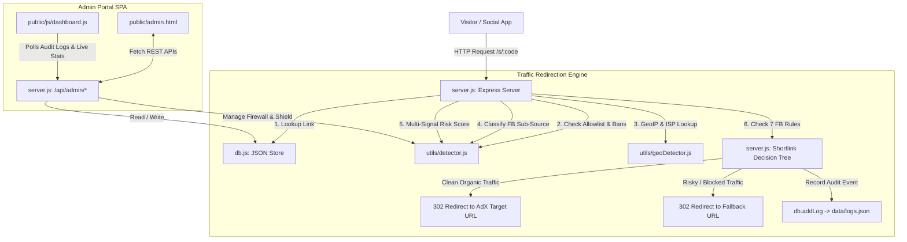

# Smart Link Shortener — Project Code Map & System Architecture

> **Purpose:** Comprehensive technical blueprint, directory map, interconnectivity guide, and module reference.  
> Any AI or human developer working on this codebase in the future should read this document to understand exactly where every file lives, how files connect, and how requests flow through the system.

---

## 📑 Table of Contents
1. [System Overview & Mission](#1-system-overview--mission)
2. [Project Directory & File Map](#2-project-directory--file-map)
3. [Module Interconnectivity & Architecture Diagram](#3-module-interconnectivity--architecture-diagram)
4. [Request Lifecycle & Traffic Redirection Pipeline](#4-request-lifecycle--traffic-redirection-pipeline)
5. [Facebook Traffic & AdX Filtering Engine (The 7 Controls)](#5-facebook-traffic--adx-filtering-engine-the-7-controls)
6. [Bot Protection, Risk Scoring & Firewall System](#6-bot-protection-risk-scoring--firewall-system)
7. [Authentication, Roles & Permissions](#7-authentication-roles--permissions)
8. [Frontend SPA Structure & UI Components](#8-frontend-spa-structure--ui-components)
9. [Data Storage Schemas (`data/*.json`)](#9-data-storage-schemas-datajson)
10. [Docker Runtime & Environment](#10-docker-runtime--environment)
11. [Guide for Future AI Sessions](#11-guide-for-future-ai-sessions)

---

## 1. System Overview & Mission

**Smart Link Shortener** is a high-performance URL shortener and traffic filtering gateway engineered specifically for **Google AdX monetization**. 

### Primary Mission:
- Send **100% clean, verified organic human traffic** to the publisher's target Google AdX ad monetization pages.
- Instantly divert **fake traffic, datacenter scrapers, headless bots, VPNs, and unapproved social sub-sources** to a safe fallback URL (e.g. `https://www.google.com/` or safe landing page).
- Protect Google AdX accounts from invalid traffic (IVT) deductions and policy strikes.

---

## 2. Project Directory & File Map

```
/root/smart-link-shortener/
├── server.js                   # Main application entry point, Express HTTP server, redirect engine & API routes
├── db.js                       # JSON database interface & data access layer
├── PROJECT_SETUP.md            # Quick reference, credentials, ports, and operational commands
├── PROJECT_CODE_MAP.md         # Full architectural map, data flows & module interconnectivity (this file)
├── test_fb_filters.js          # Automated unit & integration tests for Facebook traffic filters (21/21 passing)
├── test_traffic_quality.js     # Automated unit & integration tests for bot protection & auto-shield (25/25 passing)
├── reset-pass.js               # CLI utility to reset admin password or toggle 2FA
├── package.json                # Project dependencies and npm scripts
├── Dockerfile                  # Node.js 20 Alpine docker container configuration
├── docker-compose.yml          # Container configuration with host directory volume binding
│
├── middleware/
│   └── auth.js                 # Session authentication guard & role checker
│
├── utils/
│   ├── detector.js             # Core traffic intelligence: FB sub-source classification, bot protection, risk scoring
│   ├── geoDetector.js          # IP geo-location, ISP identification & VPN/datacenter detection
│   ├── ogFetcher.js            # OpenGraph scraper for rich social preview generation
│   ├── qrGenerator.js          # QR code generation utility
│   └── totp.js                 # 2FA RFC 6238 Time-based One-Time Password generator/verifier
│
├── data/                       # Persistent JSON flat-file storage
│   ├── links.json              # Shortlink configurations, targeting, rules & click counts
│   ├── users.json              # User accounts (Admin & Editor) with hashed passwords & permissions
│   ├── settings.json           # Global system policies, rate limits, allowlist & Facebook defaults
│   ├── logs.json               # Real-time traffic audit logs (retained up to 2,000 entries)
│   └── blocked_ips.json        # Permanently blocked IP addresses
│
└── public/                     # Frontend client assets (Single Page Application)
    ├── admin.html              # Main Admin Portal SPA interface (5 Tabs, 4 Modals)
    ├── login.html              # Login & 2FA verification portal
    ├── sw.js                   # Progressive Web App Service Worker with cache busting
    ├── manifest.json           # PWA web manifest
    ├── css/
    │   └── style.css           # Modern CSS design system (Dark, Light, Ocean, Multi themes)
    └── js/
        └── dashboard.js        # Client SPA controller (traffic stream, CRUD, rules modal, charts)
```

---

## 3. Module Interconnectivity & Architecture Diagram



---

## 4. Request Lifecycle & Traffic Redirection Pipeline

When a visitor navigates to `/:code` or `/s/:code`, the request executes in `server.js` (`handleShortlinkRedirect`):

```
1. INCOMING REQUEST
   │
2. SOCIAL CRAWLER CHECK (utils/detector.js: isSocialScraper)
   ├── IF facebookexternalhit, twitterbot, etc.
   └── THEN serve OpenGraph HTML meta tags immediately (200 OK)
   │
3. LINK LOOKUP (db.js: getLinkByCode)
   ├── IF link does not exist
   └── THEN return 404 Not Found
   │
4. PERMANENT & TEMPORARY BLOCK CHECK (utils/detector.js)
   ├── IF IP is in data/blocked_ips.json or in active memory tempBlocks
   └── THEN instant redirect to link.fallbackUrl (Status: MANUAL_IP_BLOCKED)
   │
5. TRUSTED ALLOWLIST CHECK (utils/detector.js: isIpAllowlisted)
   ├── IF IP is allowlisted
   └── THEN bypass all filters -> instant redirect to link.targetUrl
   │
6. GEO & ISP LOOKUP (utils/geoDetector.js: lookupIp)
   └── Returns: { countryCode, countryName, city, isp, isVpn }
   │
6.5 EDITOR ACCOUNTS COUNTRY BLOCK CHECK ("Unko Show Na Ho")
   ├── Check if link creator is an Editor (`isEditorLink`)
   ├── IF Editor link & visitor country is in `editorBlockedCountries` (e.g. PK, IN, BD)
   └── THEN instant redirect to Fallback (EDITOR_COUNTRY_BLOCKED). Admin links exempt!
   │
7. FACEBOOK SUB-SOURCE CLASSIFICATION (utils/detector.js: classifyFacebookTraffic)
   └── Detects: profile, group, page, story, automated, or unknown
   │
8. MULTI-SIGNAL RISK EVALUATION (utils/detector.js: computeTrafficRiskScore)
   └── Checks: Header integrity, Datacenter ASN, Headless browser, Honeypot
   └── Returns risk score [0-100] and risk level (low, medium, high)
   │
9. 7-STAGE DECISION TREE (server.js: lines 1840-1910)
   ├── 1. Is FB Traffic Master OFF? ──────────> Redirect Fallback (FB_TRAFFIC_DISABLED)
   ├── 2. Is Automated / Fake FB traffic? ────> Redirect Fallback (FB_AUTOMATED_BLOCKED)
   ├── 3. Is FB Group & Groups blocked? ──────> Redirect Fallback (FB_GROUP_BLOCKED)
   ├── 4. Is FB Page & Pages blocked? ────────> Redirect Fallback (FB_PAGE_BLOCKED)
   ├── 5. Is FB Story & Stories blocked? ─────> Redirect Fallback (FB_STORY_BLOCKED)
   ├── 6. Is FB Profile & Profiles blocked? ──> Redirect Fallback (FB_PROFILE_BLOCKED)
   ├── 7. Is Bot Protection ON & Bot detected?> Redirect Fallback (BOT_TRAFFIC_BLOCKED)
   └── ALL CHECKS PASSED? ─────────────────────> Redirect Target AdX (ORGANIC_CLICK)
   │
10. AUDIT LOGGING & CLICK INCREMENT (db.js: addLog & incrementClicks)
   └── Full log entry recorded with risk score, sub-source category, and signals.
```

---

## 5. Facebook Traffic & AdX Filtering Engine (The 7 Controls)

### The 7 Requirements & Their Implementation

| # | Requirement | Implementation | Default |
|---|---|---|---|
| **1** | **Facebook Traffic: ON/OFF** | Master toggle per link (`link.fbTrafficEnabled`) and global (`settings.fbTrafficEnabled`). When OFF, all FB traffic goes to `fallbackUrl`. | `ON` |
| **2** | **FB Profile-Origin Traffic** | Detected via clean mobile referrers, personal feeds, `profile.php`, and app clicks. Analyzed under a dedicated category (`fbSubCategory: 'profile'`) and allowed/blocked via `allowFbProfiles`. | `Allow` |
| **3** | **Groups: Block/Allow** | Detected via `/groups/`, `/g/`, `group_id`, `fb_group`. Controlled by `allowFbGroups`. | `Block/Allow` |
| **4** | **Pages: Block/Allow** | Detected via `/pages/`, `/p/`, `fb_page`, `page_id`, `fb_source=page`. Controlled by `allowFbPages`. | `Block/Allow` |
| **5** | **Stories: Block/Allow** | Detected via Facebook's mobile story share param `sfnsn`, `/stories/`, `story_fbid`. Controlled by `allowFbStories`. | `Block/Allow` |
| **6** | **Unknown / Automated Traffic** | Detected when a request claims FB origin but comes from Datacenter ISPs (AWS, Hetzner, DO) or headless scrapers. Auto-blocked via `blockAutomatedUnknown`. | `Block` |
| **7** | **Bot Protection: ON/OFF** | Per-link toggle (`link.botProtection`) evaluated before auto-shield. Evaluates VPN, missing browser headers, and rate spikes. | `ON` |

### Key Classification Function: `utils/detector.js`
`classifyFacebookTraffic(req, rawReferer, userAgent, geoInfo)`
- Inspects `rawReferer` (`l.facebook.com`, `m.facebook.com`, `facebook.com`).
- Inspects User-Agent for in-app browser tokens (`FBAN`, `FBIOS`, `FB4A`, `FB_IAB`, `FBSS`, `Messenger`).
- Inspects query parameters (`fbclid`, `sfnsn`, `group_id`, `page_id`, `fb_source`).
- Evaluates hosting ISP and headless browser signatures to separate legitimate humans from automated bots.

---

## 5.5 Editor Accounts Country Block System ("Unko Show Na Ho")

### Mission & Core Principles
This feature was added to prevent low-tier or high-risk geographic traffic generated by Editor accounts from ever hitting the publisher's Google AdX monetization target site.

1. **Only Applied to Editor Accounts (`isEditorLink`)**:
   - Shortlinks created by any user with `role === 'Editor'` (or `link.createdBy !== 'admin'`) are subject to the country block check.
   - Links created by the Super Admin (`admin`) are **100% EXEMPT** and will never be blocked by this rule.
2. **Strictly Hidden from Editors ("Unko Show Na Ho")**:
   - The Editor accounts country block card in Tab 4 (IP Firewall) is strictly restricted to Super Admin (`isSuperAdminUser()`). For Editor sessions, it is hidden with `display: none`.
   - The settings API (`GET /api/admin/settings`) sanitizes and removes `editorCountryBlockEnabled` and `editorBlockedCountries` when called by non-admin users.
   - The audit logs API (`GET /api/admin/logs`) transforms `EDITOR_COUNTRY_BLOCKED` to `FALLBACK_REDIRECT` and strips signals for Editor users, so Editors never suspect or see that country blocking is active on their accounts.
3. **Redirection Action**:
   - Visitors from blocked countries (e.g. Pakistan `PK`, India `IN`, Bangladesh `BD`) hitting an Editor's shortlink are immediately redirected with a `302 Found` to `fallbackUrl` (e.g. Google). The real AdX destination is never loaded or exposed.
4. **Customizable by Super Admin**:
   - Super Admin can configure `editorCountryBlockEnabled` (ON/OFF) and `editorBlockedCountries` (array of 2-letter ISO codes) in Tab 4 via quick toggle buttons or custom code input. Default: `['PK', 'IN', 'BD']`.

---

## 6. Bot Protection, Risk Scoring & Firewall System

### Multi-Signal Risk Scoring (`computeTrafficRiskScore` in `utils/detector.js`)
Rather than relying on a single binary check, the system computes a composite risk score between 0 and 100 based on multiple weighted signals:
- **Missing Browser Headers (+35)**: Legitimate browsers always send `Accept`, `Accept-Language`, and `Accept-Encoding`. Headless bots often omit them.
- **Datacenter / Hosting ASN (+40)**: Traffic originating from AWS, DigitalOcean, Hetzner, Linode, OVH, etc.
- **Headless Browser Tokens (+50)**: Presence of `HeadlessChrome`, `Playwright`, `Puppeteer`, `Selenium`.
- **Known Spam Scrapers (+50)**: `curl`, `python-requests`, `httpx`, `aiohttp`, `wget`, `Go-http-client`.
- **Honeypot Trigger (+60)**: Direct visits to hidden honeypot URLs.
- **VPN / Proxy Exit Node (+25)**: Detected commercial VPN / Proxy IP.

### Risk Level Thresholds:
- **Low Risk (0 - 29)**: Organic legitimate traffic. Allowed through.
- **Medium Risk (30 - 59)**: Suspicious traffic. Diverted to fallback or delayed.
- **High Risk (60 - 100)**: Definitive bot/scraper. Instant soft-block and diverted to fallback.

### Auto-Shield Rate Limiter & Spike Detector:
- **Sliding Window Rate Limiter**: Configurable via `rateLimitWindowSeconds` (default: 60s) and `rateLimitMaxRequests` (default: 30 requests per IP).
- **Spike Burst Detector**: Alerts when an IP exceeds `spikeThresholdClicks` within `spikeWindowMinutes`.
- **Temporary Soft-Blocks**: Automatically stored in memory with an expiration timestamp (`tempBlockDurationMinutes`, default: 30 min). Can be released instantly with 1-click in Tab 4.

---

## 7. Authentication, Roles & Permissions

### Users & Roles (`data/users.json`)
The system supports two user roles:
1. **Admin (Super Admin)**:
   - Full access to all shortlinks, settings, team members, global firewall, 2FA, and password management.
   - Credentials stored in `data/users.json` (bcrypt password hash).
2. **Editor**:
   - Access restricted to assigned shortlinks and features specified in their `permissions` array (`facebook`, `instagram`, `custom_website`, `links`, `domains`, `geo`).
   - Cannot modify global settings or access Super Admin cards.

### Target URL Masking / Unhiding System:
- **Individual Mode (Default)**: Target URLs for Editors are unhidden or masked based on each Editor's individual profile configuration in `data/users.json` (`unmaskTargetUrl: true/false`).
- **Global Force Unhide**: When enabled by Super Admin, all Editors can view real destination URLs without stars (`https://example.com/target`).
- **Global Force Mask**: When enabled by Super Admin, all Editors see masked URLs (`https://example.com*****`).

### 2FA Authentication (`utils/totp.js`):
- Time-based One-Time Password (TOTP) compliant with RFC 6238.
- Compatible with Google Authenticator, 1Password, and Authy.
- Can be validated via CLI:
  ```bash
  docker exec link-shortener node -e "const totp=require('./utils/totp'); const db=require('./db'); const u=db.getUserByUsername('admin'); console.log('Current OTP:', totp.generateTOTP(u.twoFactorSecret, Math.floor(Date.now()/30000)));"
  ```

---

## 8. Frontend SPA Structure & UI Components

The Admin Portal is a single-page application built with clean semantic HTML5 and vanilla JavaScript:

### SPA Tabs (`public/admin.html`):
1. **Tab 1: 🔗 Shortlinks Manager (`#tab-links`)**:
   - Clean, streamlined link creation: Target URL, Allowed Platforms chip selectors, and Optional Image Upload.
   - (Note: Facebook traffic controls are configured per-editor in Tab 5 or globally in Tab 4, keeping link creation clean and fast for Admin).
   - Shortlinks table with search, pagination, stats, QR code viewer, Edit, Delete, and **"🎯 Rules"** button.
2. **Tab 2: 📊 Analytics & Reporting (`#tab-analytics`)**:
   - Total clicks, unique visitors, conversion rate, and country breakdown.
   - **Facebook Traffic Sub-Source Widget**: Profiles, Groups, Pages, Stories, and Automated breakdown.
3. **Tab 3: 🛡️ Traffic Audit Logs (`#tab-logs`)**:
   - 4 Live Metric Cards: Legitimate, Suspicious, Bot Shield Blocked, Traffic Quality Score.
   - Sub-source filter pills: `All Traffic`, `🟢 Legitimate`, `🟡 Suspicious`, `🔴 Bot Blocked`, `👤 FB Profiles`, `👥 FB Groups`, `📄 FB Pages`, `📱 FB Stories`.
   - Real-time audit table with risk score badges, referrer badges, status badges, and 1-click Quick Ban / Whitelist buttons.
4. **Tab 4: 🚫 IP Firewall & Auto-Shield (`#tab-firewall`)**:
   - Manual IP Block form and table of permanently blocked IPs.
   - Auto-Shield & Rate Limit configuration form.
   - **Global Facebook Traffic & AdX Defaults Card** (System-wide default policy).
   - **Editor Accounts Country Block System Card** (Quick pills: US, PK, IN, BD, etc. and custom 2-letter codes).
   - Live Temporary Soft-Blocks table with 1-click "🔓 Release" buttons.
   - Trusted Sources Allowlist Manager with 1-click remove buttons.
5. **Tab 5: ⚙️ Settings & Team Management (`#tab-settings`)**:
   - Team member invitation & role assignment form (`#invite-user-form`) with:
     * Granular feature access permissions (Facebook, Instagram, Custom Web, Shortlinks, etc.)
     * Target URL visibility toggle (Unhide full URL vs Mask with stars)
     * **🎯 Facebook Traffic & AdX Controls (7 Controls) for this Editor (configured 1-by-1)**
     * **🌍 Country Blocking for this Editor's Links (Master toggle, Quick pills: US, PK, IN, BD, tag chips & custom ISO code input)**
     * Assigned allowed target domains list
   - Editor URL Visibility Settings card (Individual Mode, Force Unhide, Force Mask).
   - Google Authenticator 2FA setup & QR code viewer.
   - Change Admin Password card.

### Modals (`public/admin.html`):
- `#traffic-rules-modal`: Dedicated modal to inspect and edit the 7 Facebook traffic rules for any shortlink.
- `#qr-modal`: QR code viewer with PNG download and 1-click shortlink copy.
- `#edit-link-modal`: Edit shortlink target URLs, fallback URL, delay, and domains.
- `#edit-user-modal`: Edit user password, role, permissions, assigned target sites, **the 7 Facebook traffic controls**, and **per-editor country blocking rules**.

---

## 9. Data Storage Schemas (`data/*.json`)

### `data/links.json` (Shortlink Object)
```json
{
  "id": "lnk_1725600000000_abc12",
  "code": "adx-offer",
  "targetUrl": "https://adx-monetized-site.com/article-101",
  "fallbackUrl": "https://www.google.com/",
  "iosUrl": "",
  "androidUrl": "",
  "delaySeconds": 0,
  "botProtection": true,
  "fbTrafficEnabled": true,
  "allowFbProfiles": true,
  "allowFbGroups": false,
  "allowFbPages": true,
  "allowFbStories": true,
  "blockAutomatedUnknown": true,
  "createdBy": "admin",
  "createdAt": "2026-09-06T04:00:00.000Z",
  "clicks": 1420
}
```

### `data/settings.json` (Global System Settings)
```json
{
  "maskEditorUrls": false,
  "rateLimitWindowSeconds": 60,
  "rateLimitMaxRequests": 30,
  "webhookUrl": "",
  "botProtectionEnabled": true,
  "vpnProtectionEnabled": true,
  "botLimitClicks": 100,
  "botLimitMinutes": 1,
  "vpnLimitClicks": 500,
  "vpnLimitMinutes": 90,
  "blockSuspiciousCountries": false,
  "blockKnownScrapers": false,
  "honeypotProtectionEnabled": false,
  "restrictEditorDomains": true,
  "allowedTargetDomains": [],
  "applyFirewallGlobally": true,
  "tempBlockDurationMinutes": 30,
  "spikeWindowMinutes": 5,
  "spikeThresholdClicks": 200,
  "allowlistedIps": [],
  "fbTrafficEnabled": true,
  "allowFbProfiles": true,
  "allowFbGroups": true,
  "allowFbPages": true,
  "allowFbStories": true,
  "blockAutomatedUnknown": true
}
```

### `data/logs.json` (Audit Log Entry)
```json
{
  "id": "log_1725600123456_xyz78",
  "timestamp": "2026-09-06T04:02:10.123Z",
  "code": "adx-offer",
  "ip": "73.189.10.22",
  "countryCode": "US",
  "countryName": "United States",
  "city": "San Francisco",
  "isp": "Comcast Cable",
  "isVpn": false,
  "referer": "https://l.facebook.com/",
  "userAgent": "Mozilla/5.0 (iPhone; CPU iPhone OS 17_0 like Mac OS X) AppleWebKit/605.1.15 [FBAN/FBIOS;...]",
  "status": "ORGANIC_CLICK",
  "platform": "facebook",
  "fbSubCategory": "profile",
  "fbSubLabel": "Facebook Profile",
  "matchedDomain": "facebook.com",
  "riskScore": 10,
  "riskLevel": "low",
  "signals": "facebook_origin, fb_inapp_ua, fb_referer, fbclid_present, fb_profile_origin",
  "durationSeconds": 0,
  "actionTaken": "Redirected to Target AdX (Facebook Profile) (Instant)"
}
```

---

## 10. Docker Runtime & Environment

- **Container Name**: `link-shortener`
- **Base Image**: `node:20-alpine`
- **Port Mapping**: `3000:3000` (Host `3000` -> Container `3000`)
- **Mount Configuration**: `/:/app` (Direct bind mount; changes on host are immediately visible inside container).
- **Restarting Container**:
  ```bash
  docker restart link-shortener
  ```
- **Checking Logs**:
  ```bash
  docker logs --tail 50 link-shortener
  ```
- **Container Health Check**:
  ```bash
  curl -I http://localhost:3000/
  ```

---

## 11. Guide for Future AI Sessions

When modifying this repository in future sessions, follow these mandatory rules:

1. **Do Not Break the 7 Facebook Traffic Rules**:
   - Always run `node test_fb_filters.js` before and after any redirect changes. All 21 tests must pass.
2. **Never Show Error Pages to Blocked Visitors**:
   - Blocked or untrusted visitors must receive a smooth `302 Found` redirect to `fallbackUrl` (e.g. Google), never a 403 or error page.
3. **Keep Destination URLs Private**:
   - Never expose `targetUrl` in HTTP headers, cookies, or HTML bodies of fallback redirects.
4. **Cache Busting When Updating Frontend**:
   - When updating `public/js/dashboard.js`, bump the query parameter in `public/admin.html` (`?v=XX`) and update `CACHE_NAME` in `public/sw.js`.
5. **Preserve User Permissions & URL Masking**:
   - Ensure Editor role restrictions remain strictly enforced in both `server.js` and `public/js/dashboard.js`.

---
*Created: 2026-09-06 | Smart Link Shortener System Architecture*
